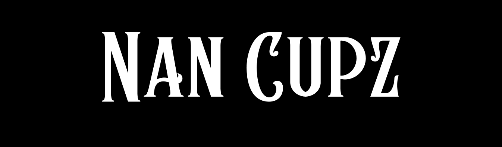

# Nan Cupz

🥤🥤🥤

## Overview

Nan Cupz is an NFT collection that redefines HORECA (Hotels-Restaurants-Cafes) integration in Web3 through the transformative power of PoG protocol. This project is a ERC-721A minting contract developed specifically for Nan Cupz collection featuring a unique feature of simultaneous minting process limited and controlled by different whitelisted groups.
Collection was deployed to Ethereum mainnet, successfully minted out and reached the total volume of 5 ETH.

Collection owner: [Dr. H](https://twitter.com/ihmmu) \
Artwork by: [Faizi](https://twitter.com/_7aizi_)

## Testing

This contract is thoroughly tested using `chai` testing library to ensure correct I/O and state management

## Getting started

00 Set environmental variable in .env (check .env.example for reference).

- `NETWORK_TESTNET_URL` and `NETWORK_MAINNET_URL` can be obtained by creating an Alchemy project and getting an API key as an HTTPS url
- `NETWORK_TESTNET_PRIVATE_KEY` and `NETWORK_MAINNET_PRIVATE_KEY` are private keys for your wallet on testnet and mainnet. The wallet is used to fund gas needed for contract deployment
- `BLOCK_EXPLORER_API_KEY` is an Etherscan API key needed to automatically upload source code of the contract and verify deployment on Etherscan

01 Install `Hardhat` environment and other dependencies

```bash
yarn install
```

02 Update contract arguments inside `lib/contractArguments.ts`

03 Update allowlist configuration inside `lib/allowlist.ts` if needed

04 Update whitelists in a JSON format in `lib/lists/<LIST_NAME>.json`

05 Run tests for the contract

```bash
yarn test
```

06 Build contract

```bash
yarn build
```

07 Deploy contract to testnet or mainnet (contract address will be logged in the console)

```bash
yarn deploy:testnet
#or
yarn deploy:mainnet
```

08 Verify contracts source code on Etherscan (etherscan api key must be set as an environmental variable)

```bash
yarn verify:testnet
#or
yarn verify:mainnet
```

09 The owner of the contract is the same wallet you used to deploy the contract

---

**&copy; 2024 steezy | All rights reserved.**

_This project is licensed under the [MIT License](https://opensource.org/license/mit/). For more information, please see the license file._

_Connect with me: [GitHub](https://github.com/steezydev) • [LinkedIn](https://www.linkedin.com/in/ivanilichevv/) • [Telegram](https://t.me/steezydev)_

_Crafted with ❤️ and a pursuit of excellence._
